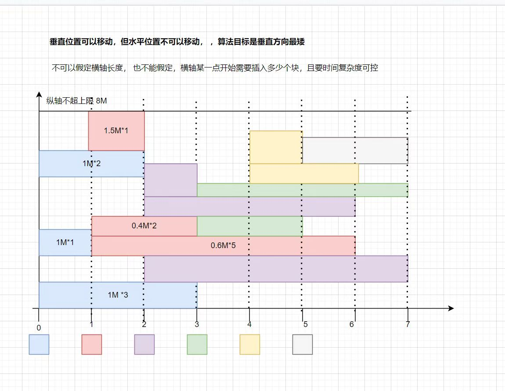

# Introduction

This project try to solve problem defined bellow

<p align="center">
  
</p>

# prerequisite packages

install prerequisite packages with the following command

```shell
sudo apt install build-essential
sudo apt install make
sudo apt install libboost1.71-dev
```

# usage

Split the memory of your device into smaller assignable parts. For example, a memory of 8MB can be split into 8 1MB parts. Then create the Memory object with the following line.

```c++
Memory memory(8);
```

Create your task to assign with a vector of vector. the upper layer vector stores tasks of all timestamp. the lower layer vector stores tasks in a specific timestamps. the value in the lower layer vector is how long (in timestamps) the task is occupying the memory part. A example of tasks is shown below.

```c++
  vector<vector<tuple<int,int> > > tasks{
    {make_tuple(1,2),make_tuple(1,1),make_tuple(1,3)},
    {make_tuple(2,1),make_tuple(1,2),make_tuple(1,5)},
    {make_tuple(2,1),make_tuple(1,4),make_tuple(1,5)},
    {make_tuple(1,4),make_tuple(1,2)},
    {make_tuple(2,1),make_tuple(1,2)},
    {make_tuple(1,2)}
  };
```

**make_tuple(1,2)** means that this task occupies 1 memory slot for 2 timestamps.

The optimal memory assignment which takes the least memory address range is generated by the following line.

```c++
Assignments assignments = memory.assign(tasks);
```

The returned matrix represents how the assignment is done. the row represents the address space. the column represents the timestamps. the value represents how long a task is occupying the memory part.


